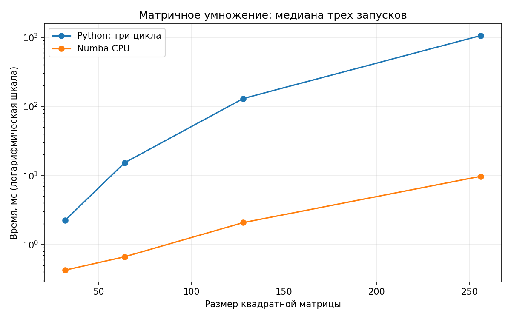

# minitorch

The full minitorch student suite.

To access the autograder:

* Module 0: https://classroom.github.com/a/qDYKZff9
* Module 1: https://classroom.github.com/a/6TiImUiy
* Module 2: https://classroom.github.com/a/0ZHJeTA0
* Module 3: https://classroom.github.com/a/U5CMJec1
* Module 4: https://classroom.github.com/a/04QA6HZK
* Quizzes: https://classroom.github.com/a/bGcGc12k

## Обучение тензорной сети

В `project/run_tensor.py` сеть с двумя скрытыми слоями по 10 нейронов обучалась на шести датасетах по 50 точек. Для всех запусков использовались seed 42, 100 эпох и скорость обучения 0.5. Точность в таблице посчитана на обучающей выборке после последнего шага SGD.

| Датасет | Loss, эпоха 1 | Loss, эпоха 100 | Верно до последнего обновления | Верно после обучения | Время эпохи 100, с | Среднее время эпохи, с |
| --- | ---: | ---: | ---: | ---: | ---: | ---: |
| Simple | 33.7314 | 0.5129 | 50/50 | 50/50 (100%) | 0.7470 | 0.7621 |
| Diag | 24.4619 | 5.9055 | 46/50 | 47/50 (94%) | 0.7595 | 0.7555 |
| Split | 41.2579 | 16.5410 | 46/50 | 47/50 (94%) | 0.7617 | 0.7624 |
| Xor | 34.1238 | 15.5765 | 43/50 | 47/50 (94%) | 0.7521 | 0.7609 |
| Circle | 52.5425 | 18.8570 | 49/50 | 37/50 (74%) | 0.7293 | 0.7434 |
| Spiral | 39.7640 | 33.8026 | 29/50 | 30/50 (60%) | 0.7549 | 0.7481 |

На `Circle` последний шаг ухудшил точность. На `Spiral` сеть за 100 эпох выучила только 30 из 50 точек.

```bash
.venv/bin/python -u project/run_tensor.py --dataset all --points 50 --hidden 10 --rate 0.5 --epochs 100 --seed 42
```

Тесты `task2_1`, `task2_2`, `task2_3` и `task2_4` прошли: 58 тестов.

## Параллельные операции на CPU

В `fast_ops.py` операции `map`, `zip` и `reduce` используют Numba и `prange`. При совпадении форм и strides `map` и `zip` работают напрямую с хранилищем. В остальных случаях вычисляют индексы с учётом broadcasting. У `reduce` адреса и шаг по оси рассчитываются до внутреннего цикла.

```bash
NUMBA_NUM_THREADS=4 .venv/bin/python -m pytest tests -x -m task3_1
NUMBA_NUM_THREADS=4 .venv/bin/python project/parallel_check.py
```

Прошли 51 исходный тест `task3_1` и 7 дополнительных тестов в `tests/test_fast_ops.py`.

## Матричное умножение

Внешний цикл выполняется параллельно: одна итерация вычисляет один элемент результата. Внутренний цикл накапливает произведения без буферов индексов. Поддерживаются пакеты матриц с broadcasting по первой оси.

```bash
NUMBA_NUM_THREADS=4 .venv/bin/python project/parallel_check.py --matmul
```

## CUDA

В `cuda_ops.py` реализованы `map`, `zip`, `reduce` и матричное умножение. Свёртка и умножение используют shared memory.

## Скорость матричного умножения

Сравнение обычных циклов Python и CPU backend. Seed 42, четыре потока Numba, медиана трёх запусков. Компиляция исключена из замера.

| Размер | Python, мс | CPU, мс | Ускорение |
| --- | ---: | ---: | ---: |
| 32 | 2.249 | 0.426 | 5.3× |
| 64 | 15.236 | 0.664 | 23.0× |
| 128 | 129.691 | 2.075 | 62.5× |
| 256 | 1055.781 | 9.701 | 108.8× |



Данные замера: [matmul_benchmark.json](project/matmul_benchmark.json). Повторный запуск:

```bash
NUMBA_NUM_THREADS=4 python project/benchmark_matmul.py --plot
```

## Обучение с быстрым backend

В `project/run_fast_tensor.py` сеть с двумя скрытыми слоями по 100 нейронов обучалась на тех же шести датасетах. В каждом запуске было 50 точек, 100 эпох, размер батча 10, скорость обучения 0.05 и seed 42. В таблице результаты CPU на четырёх потоках.

| Датасет | Loss за последнюю эпоху | Верно после обучения | Первая эпоха, с | Среднее по эпохам 2-100, с |
| --- | ---: | ---: | ---: | ---: |
| Simple | 0.7548 | 50/50 | 8.2982 | 0.0750 |
| Diag | 4.2222 | 49/50 | 0.0726 | 0.0720 |
| Split | 9.3074 | 48/50 | 0.0740 | 0.0735 |
| Xor | 9.1537 | 49/50 | 0.0731 | 0.0742 |
| Circle | 13.8100 | 46/50 | 0.0749 | 0.0743 |
| Spiral | 35.6937 | 28/50 | 0.0705 | 0.0729 |

Первая эпоха `Simple` включает компиляцию Numba. На `Spiral` эта конфигурация выучила только 28 из 50 точек.

```bash
NUMBA_NUM_THREADS=4 python project/run_fast_tensor.py --BACKEND cpu --HIDDEN 100 --DATASET all --RATE 0.05 --EPOCHS 100 --SEED 42
```

Прошли 118 тестов с метками от `task2_1` до `task3_2`.
